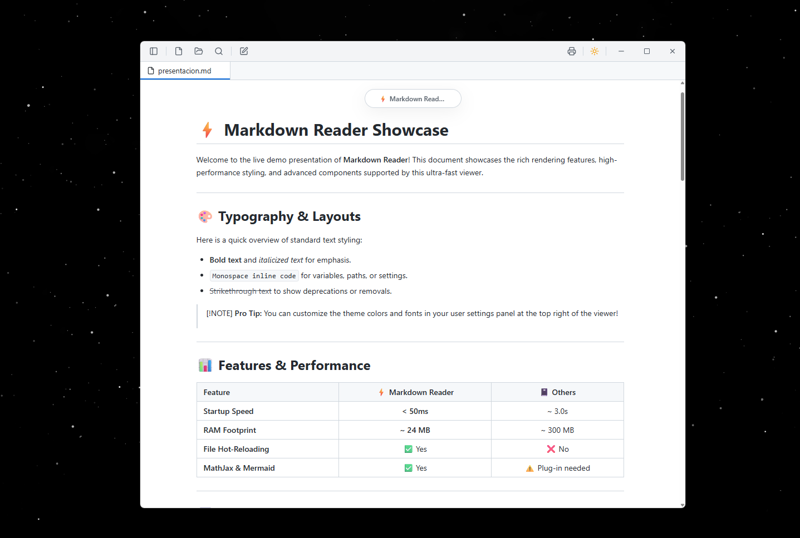

<div align="center">

# ⚡️ Markdown Reader

### **The Ultra-Fast, Anti-Electron Markdown Viewer**

`50ms startup` // `14MB binary` // `24MB RAM` // `100% Local & Private`

<br />

[](https://github.com/srsergi0/markdown-reader/releases)
[](https://github.com/srsergi0/markdown-reader/stargazers)
[](LICENSE)

<br />

**[Download Now](https://srsergi0.github.io/markdown-reader/)** • **[Read Web Documentation](https://srsergi0.github.io/markdown-reader/)**

<br />
<br />



---

</div>

## 🚀 The Performance Showdown

Why run a full instance of Chrome just to read a text file? Markdown Reader uses the operating system's native WebView, making it incredibly lightweight compared to standard editors.

| Metric | ⚡️ Markdown Reader | 📓 Obsidian | 🟦 VS Code |
| :--- | :--- | :--- | :--- |
| **Startup Time** | **< 50ms** | ~ 3.2s | ~ 2.1s |
| **RAM Idle** | **~ 24 MB** | ~ 310 MB | ~ 240 MB |
| **Binary Size** | **~ 14 MB** | ~ 280 MB | ~ 350 MB |
| **Engine** | Native WebView | Chromium (Electron) | Chromium (Electron) |

---

## 🧠 Built for the AI Era

In the era of LLMs, we generate text files, code reviews, and structured summaries at an unprecedented rate. Opening these files shouldn't lag your machine.

*   **Zero Loading Spinners:** Open `.md` outputs instantly.
*   **Privacy-First:** 100% offline. Read AI outputs and logs locally without uploading data.
*   **Dev-Centric Tooling:** Full automatic support for code syntax highlights and live Mermaid diagrams.

---

## ⚡️ Quick Start

Copy-paste to build from source in seconds:

```bash
# Get the repository
git clone https://github.com/srsergi0/markdown-reader.git && cd markdown-reader

# Install dependencies and launch dev mode
bun install && bun run dev
```

---

## 💎 Features

*   **File Association:** Double-click any `.md` file to view it immediately.
*   **Real-time File Watcher:** Auto-refreshes when files are modified by external editors or scripts.
*   **Mermaid & MathJax:** Renders flowchart schemas and math formulas out of the box.
*   **Tabbed Interface:** Manage multiple files and browsable folders efficiently.
*   **Clean Print Styles:** Export documents to PDF with custom margins and printing layouts.

---

## 🛠 Tech Stack

*   **Runtime:** [Bun](https://bun.sh)
*   **Engine:** [Electrobun](https://blackboard.sh/electrobun)
*   **Frontend UI:** [React](https://react.dev) + [Tailwind CSS](https://tailwindcss.com)
*   **Build Server:** [Vite](https://vitejs.dev)

---

## 🤝 Contributing

Contributions are what make the open source community such an amazing place to learn, inspire, and create. Any contributions you make are **greatly appreciated**.

1. Fork the Project
2. Create your Feature Branch (`git checkout -b feature/AmazingFeature`)
3. Commit your Changes (`git commit -m 'Add some AmazingFeature'`)
4. Push to the Branch (`git push origin feature/AmazingFeature`)
5. Open a Pull Request

---

## 📄 License

Distributed under the MIT License. See [LICENSE](LICENSE) for more information.
