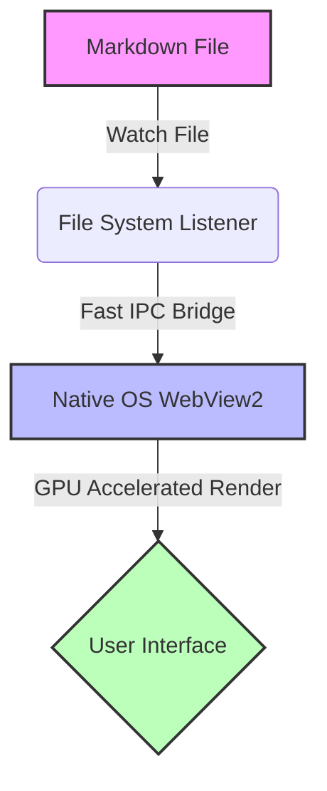

# ⚡️ Markdown Reader Showcase

Welcome to the live demo presentation of **Markdown Reader**! This document showcases the rich rendering features, high-performance styling, and advanced components supported by this ultra-fast viewer.

---

## 🎨 Typography & Layouts

Here is a quick overview of standard text styling:

*   **Bold text** and *italicized text* for emphasis.
*   `Monospace inline code` for variables, paths, or settings.
*   ~~Strikethrough text~~ to show deprecations or removals.

> [!NOTE]
> **Pro Tip:** You can customize the theme colors and fonts in your user settings panel at the top right of the viewer!

---

## 📊 Features & Performance

| Feature | ⚡️ Markdown Reader | 📓 Others |
| :--- | :---: | :---: |
| **Startup Speed** | **< 50ms** | ~ 3.0s |
| **RAM Footprint** | **~ 24 MB** | ~ 300 MB |
| **File Hot-Reloading** | ✅ Yes | ❌ No |
| **MathJax & Mermaid** | ✅ Yes | ⚠️ Plug-in needed |

---

## 💻 Developer Tools & Code Syntax

Below is a modern TypeScript snippet showing how lightweight our event bridge system is:

```typescript
import { App } from 'electrobun';

const app = new App({
  name: "Markdown Reader",
  onReady: () => {
    console.log("🚀 Application is ready to render views!");
  }
});

// Register file watch listener
app.watchFile("./document.md", (changeType) => {
  app.views.main.send("file-changed", changeType);
});
```

---

## 🧬 Renders Diagrams in Real-time

We support live rendering of complex flowcharts and systems architectures using **Mermaid**:



---

## 📐 Scientific & Math Expressions

Renders mathematical formulas seamlessly using KaTeX/MathJax integration:

$$\int_{-\infty}^{\infty} e^{-x^2} dx = \sqrt{\pi}$$

$$E = mc^2$$

---

*Enjoy reading with speed and style!*
